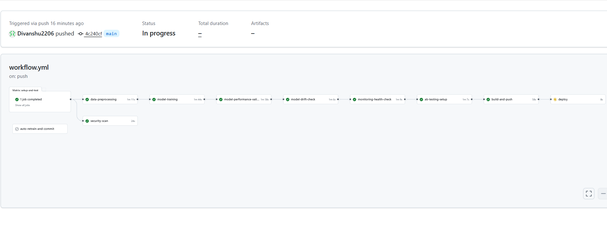

# California Housing MLOps Architecture

## Overview
This project implements a production-grade machine learning pipeline for California housing price prediction, featuring automated training, monitoring, and deployment capabilities.



## Core Components

### 1. Data Pipeline
- **Raw Data**: California housing dataset stored in `data/raw`
- **Preprocessing**: 
  - Automated data cleaning and feature engineering
  - Data validation and schema checks
  - Train-test splitting with versioning
  - Output stored in `data/processed`

### 2. Model Training Pipeline
- **Framework**: scikit-learn with RandomForestRegressor
- **MLflow Integration**:
  - Experiment tracking and versioning
  - Hyperparameter optimization
  - Model registry and artifacts storage
- **Automated Training**:
  - Scheduled retraining via cron jobs
  - Model drift detection
  - Performance benchmarking

### 3. API Service
- **Framework**: FastAPI (v0.68.2)
- **Endpoints**:
  - `/predict`: Single prediction endpoint
  - `/batch_predict`: Batch prediction support
  - `/metrics`: Model performance metrics
  - `/health`: Service health checks
- **Features**:
  - Input validation
  - Error handling
  - Request logging
  - Performance monitoring

### 4. Monitoring Stack
- **Prometheus**:
  - Metrics collection
  - Performance monitoring
  - Custom model metrics
- **Grafana**:
  - Real-time dashboards
  - Alert configuration
  - Performance visualization
- **Metrics Tracked**:
  - Prediction latency
  - Request volume
  - Model accuracy
  - System resources

### 5. Deployment Configuration
- **Environment**:
  - Production (ports: 8000, 5001, 9090, 3000)
- **Docker Configuration**:
  - Multi-service orchestration
  - Environment-specific settings
  - Health checks
  - Resource management

### 6. Testing Framework
- **Unit Tests**: Individual component testing
- **Integration Tests**: Service interaction testing
- **Performance Tests**: Load and stress testing
- **Pipeline Tests**: End-to-end workflow validation

### 7. CI/CD Pipeline
- **Automated Testing**
- **Docker Image Building**
- **Environment-specific Deployments**
- **Rollback Capabilities**

## Directory Structure
```
ML_ops_Assignment/
├── data/                 # Data storage
├── docker/               # Docker configurations
├── logs/                 # Application logs
├── mlruns/              # MLflow experiment data
├── models/              # Model artifacts
├── monitoring/          # Monitoring configs
├── scripts/             # Automation scripts
├── src/                 # Source code
└── tests/               # Test suites
```

## Security Features
- Non-root container execution
- Environment variable management
- Port isolation between environments
- Health check implementation
- Secure API endpoints

## Scalability Considerations
- Containerized deployment
- Production environment management
- Resource monitoring
- Performance optimization
- Batch prediction support
